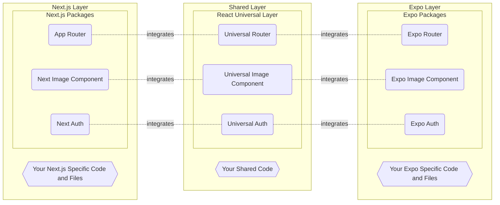

<p align='center'>
    <h1 align='center'>React Universal Layer</h1>
</p>
<p align='center'>
  <a aria-label='Join our Discord' href='' target='_blank'>
    
  </a>
  <a aria-label='React Universal Layer is free to use' href='' target='_blank'>
    
  </a>
</p>

---

- [📍 Goal and Guidelines](#-goal-and-guidelines)
  - [🍃 Making React Cross-Platform Development a Breeze](#-making-react-cross-platform-development-a-breeze)
  - [🏁 Be the Starting Point for New Projects](#-be-the-starting-point-for-new-projects)
  - [🚦 Staying as Close to the Original Design as Possible](#-staying-as-close-to-the-original-design-as-possible)
  - [📏 Be Small to Always Stay Up to Date](#-be-small-to-always-stay-up-to-date)
  - [🌐 Using Next.js as the Only Web Technology](#-using-nextjs-as-the-only-web-technology)
  - [💡 Implementation Reference Sections](#-implementation-reference-sections)
- [🚀 Getting Started](#-getting-started)
  - [Creating a Minimal App](#creating-a-minimal-app)
  - [🌟 Creating a Batteries Included App](#-creating-a-batteries-included-app)
  - [Installing on Your Existing App](#installing-on-your-existing-app)
- [📚 Documentation](#-documentation)
  - [🗄️ Roles of Files and Folders](#️-roles-of-files-and-folders)
    - [Important Rules](#important-rules)
    - [Files Roles](#files-roles)
    - [Folders Roles](#folders-roles)
  - [⛖ Linking and Navigating](#-linking-and-navigating)
    - [Navigation with `<Link>` Component](#navigation-with-link-component)
    - [Imperative Navigation with `router`](#imperative-navigation-with-router)
    - [Get Param(s) Sent Throug Route](#get-params-sent-throug-route)
  - [🖼️ `<Image />` Component](#️-image--component)
  - [🔑 Authentication](#-authentication)
- [👏 Contributing](#-contributing)
- [⚖️ License](#️-license)

## 📍 Goal and Guidelines

> **IMPORTANT TO KNOW**
>
> This project **DOES NOT SUPPORT** Next.js's Pages Router and **IS NOT TESTED** with React Navigation. [Read more](#be-small-to-always-stay-up-to-date).

The **React Universal Layer** is a thin layer of integration between the [Next.js](https://nextjs.org/) and [Expo](https://expo.dev/home) APIs, solving API compatibility issues and providing a unified API that works with very little interference between framework APIs. The main pain solved is not having to worry about the specifics of each framework and simply using their available APIs, it's designed in a way that you don't even notice it's there.

The macro goal of the **React Universal Layer** is to provide a simplified and integrated development for "React Universal Apps", a concept where shared React Native code is written using together the best technologies available in the React and JavaScript ecosystems using the same codebase, always sharing as much code as possible and making code unique to only one platform explicit through architecture.

❤️ This project is heavily inspired by [Solito](https://solito.dev/), thanks a lot to your amazing work! You can also understand more about "React Universal Apps" in these projects: [create-universal-app](https://github.com/chen-rn/CUA), [create-t3-turbo](https://github.com/t3-oss/create-t3-turbo), [next-expo-solito](https://github.com/tamagui/tamagui/tree/master/starters/next-expo-solito) and [t3-turbo-and-clerk](https://github.com/clerkinc/t3-turbo-and-clerk).

The flowchart below defines how this works in practice.



### 🍃 Making React Cross-Platform Development a Breeze

Writing code that works on all platforms (Web, Android and iOS) is a difficult task, but writing code that works on all platforms using the best of your "native environments" is an even more difficult task. **React Universal Layer** offers integrations and complete documentation to make development as easy as possible. Currently the best technologies in the ecosystem for this approach are Next.js ([React DOM](https://react.dev/)) for Web and Expo ([React Native](https://reactnative.dev/)) for Android and iOS.

> Desktop development is a more complex topic as there are two good ways to go: building Web-Based Apps with [Electron](https://www.electronjs.org/) or [Tauri](https://tauri.app/), or building Native Apps with [React Native Windows](https://github.com/microsoft/react-native-windows) and [React Native macOS](https://github.com/microsoft/react-native-macos).

> We know that [Remix](https://remix.run/) is also an excellent technology, but theoretically still little adopted. If you want to see it integrated, let us know!

### 🏁 Be the Starting Point for New Projects

Integrating **React Native Layer** into a new project can be a tedious process, plus you need to know the best packages that work fully Natively and on the Web. To make this job easier we provide a CLI that allows you to create a Batteries Included, offline-first App with [Tamagui](https://tamagui.dev/), [TanStack Query](https://tanstack.com/query/latest), [Zustand](https://zustand-demo.pmnd.rs/), [React Native MMKV](https://github.com/mrousavy/react-native-mmkv) and [ESLint](https://eslint.org/).

### 🚦 Staying as Close to the Original Design as Possible

We never intend to create new features or offer APIs that are not available in both frameworks, limiting ourselves to creating types, parameters or methods if really necessary. The whole integration rule is under the hood so you don't have to learn anything new.

### 📏 Be Small to Always Stay Up to Date

This project needs to be always up to date to work properly, so keeping things small and simple is essential to avoid falling into trouble. Unfortunately this meant that things had to be cut back and it was decided to **drop support for Next.js's Pages Router and React Navigation**, focusing all resources on integrating Next.js's App Router and Expo Router APIs. This situation may change in the future, let us know!

### 🌐 Using Next.js as the Only Web Technology

Despite being often seen as a framework for Hybrid Mobile Development, Expo positions itself as a framwork for 'Universal Native Apps with React That Run on Android, iOS, and the Web'. This means that more and more of its packages provide full support for the Web, dispensing with the integration of another technology such as Next.js. However, resources are scarce and Expo's main focus is on Native Apps, at the moment offering only basic web resources, so it's important to use Next.js exclusively for building more optimized and modern Web Applications.

### 💡 Implementation Reference Sections

Each section of the documentation can have a hidden section at the end called 'Implementation Reference', responsible for gathering all the information necessary to demonstrate the use and differences between the frameworks, as well as mapping possible new additions that need to be made for full integration. You don't have to worry about it, it's just for curious people and developers of this package.

## 🚀 Getting Started

### Creating a Minimal App

```shell
npx create-universal-layer-app@latest
```

### 🌟 Creating a Batteries Included App

```shell
npx create-universal-layer-app@latest --template with-batteries-included
```

### Installing on Your Existing App

###### npm

```shell
npm install react-universal-layer@latest
```

###### yarn

```shell
yarn add react-universal-layer@latest
```

## 📚 Documentation

### 🗄️ Roles of Files and Folders

There is nothing new here, this section of the documentation has the sole purpose of succinctly summarizing and keeping track of all folder and file scenarios possible to implement in each framework.

- ✅ Role supported for the framework.
- ❌ Role not supported for the framework.
- 🔨 Role not supported for the framework, but has workaround.

#### Important Rules

##### App Router Requires a Root Layout

App Router requires a root `📄 layout.tsx` defined in `📁 app`. Expo Router does not require.

##### Using Your Own Files Inside Routers

In the App Router **you can put any file you want inside the `📁 app`** because every file that represents a part of the Router is a file that follows a naming convention. On the other hand, in Expo Router a file with a generic name is considered a route, so **you cannot put your files inside the `📁 app`** having to manage them in a separate folder.

#### Files Roles

##### Page File

Unique UI of a route and make routes publicly accessible.

###### ✅ App Router

```diff
├── 📁 app
    ├── 📄 layout.tsx
+   ├── 📄 page.tsx
```

###### ✅ Expo Router

```diff
├── 📁 app
+   ├── 📄 index.tsx
```

```diff
├── 📁 app
+   ├── 📄 route-name.tsx
```

##### Layout File

Shared UI for a segment and its children.

###### ✅ App Router

```diff
├── 📁 app
+   ├── 📄 layout.tsx
    ├── 📄 page.tsx
```

###### ✅ Expo Router

```diff
├── 📁 app
+   ├── 📄 _layout.tsx
    ├── 📄 index.tsx
```

##### Loading File

###### ✅ App Router

```diff
├── 📁 app
+   ├── 📄 loading.tsx
    ├── 📄 layout.tsx
    ├── 📄 page.tsx
```

###### 🔨 Expo Router

<!-- TODO: Verify if Root Layout File works -->

Manage loading state inside your [Page File](#page-file) or [Layout File](#layout-file).

```tsx
import { useState, useEffect } from "react";

function Loading() { ... }

export default function Page() {
  const [isLoading, setIsLoading] = useState(true);

  useState(() => {
    ...
    setIsLoading(false);
  }, [...])

  if (isLoading) return <Loading />;

  return ...;
}
```

##### Not Found File

Not found UI for a segment and its children.

###### ✅ App Router

```diff
├── 📁 app
+   ├── 📄 not-found.tsx
    ├── 📄 layout.tsx
    ├── 📄 page.tsx
```

###### ✅ Expo Router

```diff
├── 📁 app
+   ├── 📄 [...unmatched].tsx
    ├── 📄 _layout.tsx
    ├── 📄 index.tsx
```

```tsx
import { Unmatched } from "expo-router";

export default Unmatched;
```

##### Error File

Error UI for a segment and its children.

###### ✅ App Router

```diff
├── 📁 app
    ├── 📄 layout.tsx
    ├── 📁 parent-route-name
        ├── 📄 page.tsx
+       ├── 📄 error.tsx
```

Having `📄 error.tsx` in root directory doesn't work. To get this behavior you need to use [Global Error File](#global-error-file).

```diff
# It doesn't work.
├── 📁 app
    ├── 📄 layout.tsx
    ├── 📄 page.tsx
+   ├── 📄 error.tsx
```

###### 🔨 Expo Router

<!-- TODO: Verify if Layout File works -->

Export a default `Error Boundary` function inside your [Page File](#page-file) or [Layout File](#layout-file).

```tsx
import { ErrorBoundaryProps } from 'expo-router';

export function ErrorBoundary(props: ErrorBoundaryProps) { ... }

export default function Page() { ... }

//OR

export default function Layout() { ... }
```

##### Global Error File

Global Error UI.

###### ✅ App Router

```diff
├── 📁 app
+   ├── 📄 global-error.tsx
    ├── 📄 layout.tsx
    ├── 📄 page.tsx
```

###### 🔨 Expo Router

<!-- TODO: Verify if Root Layout File works -->

Expo Router does not differentiate between global and non-global errors. Export a default `Error Boundary` function inside your Root [Page File](#page-file) or Root [Layout File](#layout-file).

```tsx
import { ErrorBoundaryProps } from 'expo-router';

export function ErrorBoundary(props: ErrorBoundaryProps) { ... }

export default function RootPage() { ... }

//OR

export default function RootLayout() { ... }
```

##### Template File

Specialized re-rendered Layout UI. Templates are similar to layouts in that they wrap each child layout or page. Unlike layouts that persist across routes and maintain state, templates create a new instance for each of their children on navigation.

###### ❌ Expo Router

###### ✅ App Router

```diff
├── 📁 app
+   ├── 📄 template.tsx
    ├── 📄 layout.tsx
    ├── 📄 page.tsx
```

##### Default File

Fallback UI for [Parallel Routes](parallel-routes).

###### ❌ Expo Router

###### ✅ App Router

Next.js documentation is still being written.

#### Folders Roles

##### Root Route

Matches route `/`.

###### ✅ App Router

```shell
├── 📁 app
    ├── 📄 layout.tsx
    ├── 📄 page.tsx
```

###### ✅ Expo Router

```shell
├── 📁 app
    ├── 📄 index.tsx
```

##### Named Routes

Matches route `/route-name`.

###### ✅ App Router

```shell
├── 📁 app
    ├── 📄 layout.tsx
    ├── 📁 route-name
        ├── 📄 page.tsx
```

###### ✅ Expo Router

```shell
├── 📁 app
    ├── 📄 route-name.tsx
```

```shell
├── 📁 app
    ├── 📁 route-name
        ├── 📄 index.tsx
```

##### Nested Routes

Matches route `/parent-route-name/child-route-name`.

###### ✅ App Router

```shell
├── 📁 app
    ├── 📄 layout.tsx
    ├── 📁 parent-route-name
        ├── 📁 child-route-name
            ├── 📄 page.tsx
```

###### ✅ Expo Router

```shell
├── 📁 app
    ├── 📁 parent-route-name
        ├── 📄 child-route-name
```

```shell
├── 📁 app
    ├── 📁 parent-route-name
        ├── 📁 child-route-name
            ├── 📄 index.tsx
```

##### Dynamic Route with One Parameter

Matches route `/route-name/[param]` where `📁 [param]` is a single value sent by the route.

###### ✅ App Router

```shell
├── 📁 app
    ├── 📄 layout.tsx
    ├── 📁 route-name
        ├── 📁 [param]
            ├── 📄 page.tsx
```

###### ✅ Expo Router

```shell
├── 📁 app
    ├── 📁 route-name
        ├── 📄 [param].tsx
```

```shell
├── 📁 app
    ├── 📁 route-name
        ├── 📁 [param]
            ├── 📄 index.tsx
```

##### Dynamic Route with Multiple Parameters

Matches route `/route-name/[...params]` where `📁 [...params]` is a array of values sent by the route.

###### ✅ App Router

Navigation to `/route-name` doesn't work. To get this behavior you need to use [Multiple Optional Parameters](#dynamic-route-with-multiple-optional-parameters).

```shell
# It doesn't work.
├── 📁 app
    ├── 📄 layout.tsx
    ├── 📁 route-name
        ├── 📁 [...params]
            ├── 📄 page.tsx
```

###### ✅ Expo Router

```shell
├── 📁 app
    ├── 📁 route-name
        ├── 📄 [...params].tsx
```

```shell
├── 📁 app
    ├── 📁 route-name
        ├── 📁 [...params]
            ├── 📄 index.tsx
```

##### Dynamic Route with Multiple Optional Parameters

Matches route `/route-name/[[...params]]` where `📁 [[...params]]` is a array of values sent by the route or nothing (`/route-name`).

###### ✅ App Router

```shell
├── 📁 app
    ├── 📄 layout.tsx
    ├── 📁 route-name
        ├── 📁 [[...params]]
            ├── 📄 page.tsx
```

###### ✅ Expo Router

<!-- TODO: Try navigate to '/route-name'  -->

In Expo Router Multiple Parameters are optional by default.

```shell
├── 📁 app
    ├── 📁 route-name
        ├── 📄 [...params].tsx
```

```shell
├── 📁 app
    ├── 📁 route-name
        ├── 📁 [...params]
            ├── 📄 index.tsx
```

##### Route Groups

Matches route `/route-name`.

###### ✅ App Router

```shell
├── 📁 app
    ├── 📄 layout.tsx
    ├── 📁 (group-name)
        ├── 📁 route-name
            ├── 📄 page.tsx
```

###### ✅ Expo Router

```shell
├── 📁 app
    ├── 📁 (group-name)
        ├── 📄 route-name.tsx
```

```shell
├── 📁 app
    ├── 📁 (group-name)
        ├── 📁 route-name
            ├── 📄 index.tsx
```

##### Parallel Routes

###### ❌ Expo Router

###### ✅ App Router

Matches route `/`. The `📄 page.tsx` component of the `📁 @parallel-route-one` and `📁 @parallel-route-two` routes are passed to `📄 layout.tsx` via `props`.

```shell
├── 📁 app
    ├── 📄 layout.tsx
    ├── 📄 page.tsx
    ├── 📁 @parallel-route-one
        ├── 📄 page.tsx
    ├── 📁 @parallel-route-two
        ├── 📄 page.tsx
```

##### Intercepting Routes

###### ❌ Expo Router

###### ✅ App Router

When navigating to `/intercepting-route-name/paramValue` within `/route-name` this route will be intercepted and the URL updated to `/intercepting-route-name/paramValue`, however when this URL is shared the level context defined by convention will be maintained. It can be combined with Parallel Routes to obtain an excellent pattern for modals.

- Convention:
  - `(.)` matchs segments on the same level
  - `(..)` matchs segments one level above
  - `(..)(..)` matchs segments two levels above
  - `(...)` matchs segments from the root app directory

```shell
├── 📁 app
    ├── 📁 route-name
        ├── 📁 (..)intercepting-route-name
            ├── 📁 [param]
                ├── 📄 page.tsx
    ├── 📁 intercepting-route-name
        ├── 📁 [param]
            ├── 📄 page.tsx
```

##### Shared Routes

###### ❌ App Router

###### ✅ Expo Router

Allows the same URL to be rendered with different layouts through the use of Route Groups. All Route Groups have access to `📄 [param].tsx`: `/(group-name-one)/[param].tsx`, `/(group-name-two)/[param].tsx` and `/(group-name-three)/[param].tsx`.

```shell
├── 📁 app
    ├── 📁 (group-name-one)
        ├── 📄 _layout.tsx
        ├── 📄 [param].tsx
    ├── 📁 (group-name-two)
        ├── 📄 _layout.tsx
        ├── 📄 [param].tsx
    ├── 📁 (group-name-three)
        ├── 📄 _layout.tsx
        ├── 📄 [param].tsx
```

Duplication can be reduced using Array Syntax:

```shell
├── 📁 app
    ├── 📁 (group-name-one, group-name-two, group-name-three)
        ├── 📄 _layout.tsx
        ├── 📄 [param].tsx
```

### ⛖ Linking and Navigating

#### Navigation with `<Link>` Component

##### Usage

###### Static Route with `href` as `String`

```tsx
import { Link } from "react-universal-layer/navigation";

export default function Page() {
  // Route -> /about
  return <Link href="/about">About</Link>;
}
```

###### Dynamic Route with `href` as `String`

```tsx
import { Link } from "react-universal-layer/navigation";

export default function Page() {
  // Route -> /user/[username]
  return <Link href="/user/gloredo">View user</Link>;
}
```

###### Static Route with `href` as `Object`

```tsx
import { Link } from "react-universal-layer/navigation";

export default function Page() {
  // Route -> /about
  return (
    <Link
      href={{
        pathname: "/about",
      }}
    >
      About
    </Link>
  );
}
```

###### Dynamic Route with `href` as `Object`

```tsx
import { Link } from "react-universal-layer/navigation";

export default function Page() {
  // Route -> /user/[username]
  return (
    <Link
      href={{
        pathname: "/user/[username]",
        params: { username: "gloredo" },
      }}
    >
      View user
    </Link>
  );
}
```

###### Children as a Custom Component

```tsx
import { Pressable, Text } from "react-native";
import { Link } from "react-universal-layer/navigation";

export default function Page() {
  // Route -> /about
  return (
    <Link href="/about">
      <Pressable>
        <Text>About</Text>
      </Pressable>
    </Link>
  );
}
```

##### API Reference

| Param | Type | Required | Default | App Router | Expo Router |
| --- | --- | --- | --- | --- | --- |
| `href` | `String` or `Object` | Yes |  | ✅ | ✅ |
| `replace` | `Boolean` | No | `false` | ✅ | ✅ |
| `prefetch` | `Boolean` | No | `true` | ✅ | ❌ |

<details>

<summary>Implementation Reference</summary>

##### Invoking on App Router

```tsx
import Link from 'next/link';
...
return <Link href={...}>...</Link>;
...
```

##### Invoking on Expo Router

```tsx
import { Pressable, Text } from 'react-native';
import { Link } from 'expo-router';
...
// If the child is a custom component.
// The child component must support the onPress and onClick props, href and accessibilityRole will also be passed down.
return (
  <View>
    <Link href={...}>...</Link>

    <Link href={...} asChild>
      <Pressable>
        <Text>...</Text>
      </Pressable>
    </Link>
  </View>
);
...
```

##### API Reference Comparasion

| Param | Type | Required | App Router | Expo Router | Incompatibility note |
| --- | --- | --- | --- | --- | --- |
| `href` | `String` or `Object` | Yes | ✅ | ✅ | Objects are different. App Router uses `object.query` and Expo Router uses `object.params`. |
| `replace` | `Boolean` | No | ✅ | ✅ |  |
| `prefetch` | `Boolean` | No | ✅ | ❌ |  |
| `asChild` | `Boolean` | No | ❌ | ✅ |  |

##### Integration Rules Implemented

- If `typeof children === React.ReactNode`:
  - Expo Router:
    - Set `asChild={true}`

</details>

#### Imperative Navigation with `router`

<details>

<summary>Implementation Reference</summary>

##### Invoking on App Router

```tsx
import { useRouter } from 'next/router';
...
const router = useRouter();
router.methodName();
...
```

##### Invoking on Expo Router

```tsx
import { router } from 'expo-router';
...
router.methodName();
...
```

##### API Reference Comparasion

| Method | Type | App Router | Expo Router | Incompatibility note |
| --- | --- | --- | --- | --- |
| `push` | App Router: `(url: UrlObject \| String, as: UrlObject \| String, options) => void`. <br> Expo Router: `(href: Href) => void`. | ✅ | ✅ | Types are different. |
| `replace` | App Router: `(url: UrlObject \| String, as: UrlObject \| String, options) => void`. <br> Expo Router: `(href: Href) => void`. | ✅ | ✅ | Types are different. |
| `back` | `() => void` | ✅ | ✅ |  |
| `prefetch` | `(url: UrlObject \| String, as: UrlObject \| String, options) => void` | ✅ | ❌ |  |
| `beforePopState` | `(cb: {url: UrlObject \| String, as: UrlObject \| String, options}) => bool` | ✅ | ❌ |  |
| `reload` | `() => void` | ✅ | ❌ |  |
| `events` | [See in the docs](https://nextjs.org/docs/pages/api-reference/functions/use-router#routerevents) | ✅ | ❌ |  |
| `setParams` | `(params: Record<string, string>) => void` | ❌ | ✅ |  |

</details>

#### Get Param(s) Sent Throug Route

<details>

<summary>Implementation Reference</summary>

##### Invoking on App Router

```tsx
import Link from 'next/link'
...
return <Link
  href={{
    pathname: '/route-name/[paramOne]/[paramTwo]',
    query: { paramOne: 'paramOneValue', paramTwo: 'paramTwoValue' },
  }}
>...</Link>;
...
import { useParams } from 'next/navigation'
...
//URL -> /route-name/paramOneValue/paramTwoValue
const { paramOne, paramTwo } = useParams(); //-> { paramOne: 'paramOneValue', paramTwo: 'paramTwoValue' }
...
```

```tsx
import Link from 'next/link'
...
return <Link
 href='/route-name?searchParam=searchParamValueOne&searchParam=searchParamValueTwo'
>...</Link>;

// OR

return <Link
  href={{
    pathname: '/route-name',
    query: { searchParam: ['searchParamValueOne', 'searchParamValueTwo'] },
  }}
>...</Link>;
...
'use client'

import { useSearchParams } from 'next/navigation'
...
const searchParams = useSearchParams();

//URL -> /route-name?searchParam=searchParamValueOne&searchParam=searchParamValueTwo
const searchParamSingleValue = searchParams.get('searchParam') //-> 'searchParamValueOne'
const searchParamAllValues = searchParams.getAll('searchParam') //-> ['searchParamValueOne', 'searchParamValueTwo']
...
```

##### Invoking on Expo Router

```tsx
import { Link } from 'expo-router';
...
return <Link
 href={{
   pathname: 'route-name',
   params: { paramOne: 'paramOneValue', paramTwo: 'paramTwoValue' }
 }}
>...</Link>;

// OR

return <Link
 href='route-name?paramOne=paramOneValue&paramTwo=paramTwoValue'
>...</Link>;
...
import { useLocalSearchParams, useGlobalSearchParams } from 'expo-router';
...
//Prevent the background screens re-render when params are changed
const { paramOne, paramTwo } = useLocalSearchParams(); //-> { paramOne: 'paramOneValue', paramTwo: 'paramTwoValue' }

//Made the background screens re-render when params are changed
const { paramOne, paramTwo } = useGlobalSearchParams(); //-> { paramOne: 'paramOneValue', paramTwo: 'paramTwoValue' }
...
```

##### Distinction Between Path Parameters and Query Parameters

While the App Router distinguishes the parameters between [Path Parameters](https://swagger.io/docs/specification/describing-parameters/#path-parameters) and [Query Parameters/Query String](https://swagger.io/docs/specification/describing-parameters/#query-parameters) allowing access to them through the `useParams` and `useSearchParams` hooks, Expo Router does not distinguish, bringing both parameters through the `useLocalSearchParams` and `useGlobalSearchParams` hooks.

A limitation of Expo Router is that it only accepts one type of parameter per navigation call on static routes, which means that if you pass the `href.pathname` with Query Parameters and `href.params` with values, only the `href.pathname` values are accessible and `href.params` values are ignored. Let's see an example:

```tsx
import { Link } from 'expo-router';
...
return <Link
 href={{
   pathname: 'route-name?queryParam=queryParamValue',
   params: { pathParam: 'pathParamValue' }
 }}
>...</Link>;
...
import { useLocalSearchParams } from 'expo-router';
...
// Throw an error because pathParam doesn't exist
const { queryParam, pathParam } = useLocalSearchParams();
...
```

However, when using Dynamic Routes it works as expected. Let's see an example:

```tsx
import { Link } from 'expo-router';
...
<Link
 href={{
   pathname: 'route-name/[pathParam]?queryParam=queryParamValue',
   params: { pathParam: 'pathParamValue' }
 }}
>...</Link>
...
import { useLocalSearchParams } from 'expo-router';
...
// Return both values as expected
const { queryParam, pathParam } = useLocalSearchParams(); //-> { queryParam: 'queryParamValue', pathParam: 'pathParamValue' }
...
```

</details>

### 🖼️ `<Image />` Component

### 🔑 Authentication

## 👏 Contributing

If you like **React Universal Layer** and want to help make it better, just open an issue or discussion in this repository.

## ⚖️ License

The **React Universal Layer** source code is made available under the [MIT license](LICENSE).
