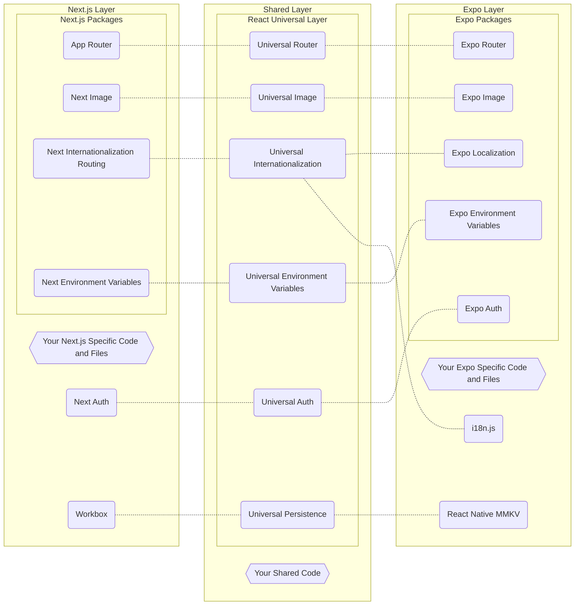

<p align='center'>
    <h1 align='center'>React Universal Layer</h1>
</p>

- [:world_map: Project Layout](#world_map-project-layout)
- [:dart: Goal and Guidelines](#dart-goal-and-guidelines)
  - [:leaves: Making React Cross-Platform Development a Breeze](#leaves-making-react-cross-platform-development-a-breeze)
  - [:checkered_flag: Be the Starting Point for New Projects](#checkered_flag-be-the-starting-point-for-new-projects)
  - [:vertical_traffic_light: Staying as Close to the Original Design as Possible](#vertical_traffic_light-staying-as-close-to-the-original-design-as-possible)
  - [:straight_ruler: Be Small to Always Stay Up to Date](#straight_ruler-be-small-to-always-stay-up-to-date)
  - [:arrow_up_down: Using Next.js as the Only Web Technology](#arrow_up_down-using-nextjs-as-the-only-web-technology)
  - [:bulb: Implementation Reference Sections](#bulb-implementation-reference-sections)
- [:rocket: Getting Started](#rocket-getting-started)
  - [Creating a Minimal App](#creating-a-minimal-app)
  - [:battery: Creating a Batteries Included App](#battery-creating-a-batteries-included-app)
  - [Installing on Your Existing App](#installing-on-your-existing-app)

> **IMPORTANT TO KNOW**
>
> This project **DOES NOT SUPPORT** Next.js's Pages Router and **IS NOT TESTED** with React Navigation. [Read more](#straight_ruler-be-small-to-always-stay-up-to-date).

## :world_map: Project Layout

This repository is a monorepo that contains three main projects.

- `📄 README.md`: Project overview.
- 📁 [lib](/lib/): Library project.
  - `📄 README.md`: Library documentation.
  - `📁 src`: All library code, including Router, Image, Auth, Internationalization, Environment Variables and Persistence.
- 📁 [cli](/cli/): Command-line Interface project.
  - `📄 README.md`: Command-line Interface documentation.
  - `📁 src`: All `react-universal-layer-cli` code.
  - 📁 [templates](/cli/templates/): All templates that can be used with the CLI.
    - `📄 README.md`: Templates documentation.
    - `📁 src`: All templates code.
- 📁 [vscode-extension](/vscode-extension/): Visual Studio Code Extension project.
  - `📄 README.md`: Visual Studio Code Extension documentation.
  - `📁 src`: All Visual Studio Code Extension documentation code.

## :dart: Goal and Guidelines

The **React Universal Layer** is a thin layer of integration between the [Next.js](https://nextjs.org/) and [Expo](https://expo.dev/home) APIs, solving API compatibility issues and providing a unified API that works with very little interference between framework APIs. The main pain solved is not having to worry about the specifics of each framework and simply using their available APIs, it's designed in a way that you don't even notice it's there.

The macro goal of the **React Universal Layer** is to provide a simplified and integrated development for "React Universal Apps", a concept where shared React Native code is written using together the best technologies available in the React and JavaScript ecosystems using the same codebase, always sharing as much code as possible and making code unique to only one platform explicit through architecture.

:heart: This project is heavily inspired by [Solito](https://solito.dev/), thanks a lot to your amazing work! You can also understand more about "React Universal Apps" in these projects: [create-universal-app](https://github.com/chen-rn/CUA), [create-t3-turbo](https://github.com/t3-oss/create-t3-turbo), [next-expo-solito](https://github.com/tamagui/tamagui/tree/master/starters/next-expo-solito) and [t3-turbo-and-clerk](https://github.com/clerkinc/t3-turbo-and-clerk).

The flowchart below defines how this works in practice.



### :leaves: Making React Cross-Platform Development a Breeze

Writing code that works on all platforms (Web, Android and iOS) is a difficult task, but writing code that works on all platforms using the best of your "native environments" is an even more difficult task. **React Universal Layer** offers integrations and complete documentation to make development as easy as possible. Currently the best technologies in the ecosystem for this approach are Next.js ([React DOM](https://react.dev/)) for Web and Expo ([React Native](https://reactnative.dev/)) for Android and iOS.

> Desktop development is a more complex topic as there are two good ways to go: building Web-Based Apps with [Electron](https://www.electronjs.org/) or [Tauri](https://tauri.app/), or building Native Apps with [React Native Windows](https://github.com/microsoft/react-native-windows) and [React Native macOS](https://github.com/microsoft/react-native-macos).

> We know that [Remix](https://remix.run/) is also an excellent technology, but theoretically still little adopted. If you want to see it integrated let us know!

### :checkered_flag: Be the Starting Point for New Projects

Integrating **React Native Layer** into a new project can be a tedious process, plus you need to know the best packages that work fully Natively and on the Web. To make this job easier we provide a CLI that allows you to create a Batteries Included, offline-first App with [Tamagui](https://tamagui.dev/), [TanStack Query](https://tanstack.com/query/latest), [Zustand](https://zustand-demo.pmnd.rs/), [React Native MMKV](https://github.com/mrousavy/react-native-mmkv), [Workbox](https://developer.chrome.com/docs/workbox/) and [ESLint](https://eslint.org/).

### :vertical_traffic_light: Staying as Close to the Original Design as Possible

We never intend to create new features or offer APIs that are not available in both frameworks, limiting ourselves to creating types, parameters or methods if really necessary. The whole integration rule is under the hood so you don't have to learn anything new.

### :straight_ruler: Be Small to Always Stay Up to Date

This project needs to be always up to date to work properly, so keeping things small and simple is essential to avoid falling into trouble. Unfortunately this meant that things had to be cut back and it was decided to **drop support for Next.js's Pages Router and React Navigation**, focusing all resources on integrating Next.js's App Router and Expo Router APIs. This situation may change in the future, let us know!

### :arrow_up_down: Using Next.js as the Only Web Technology

Despite being often seen as a framework for Hybrid Mobile Development, Expo positions itself as a framwork for 'Universal Native Apps with React That Run on Android, iOS, and the Web'. This means that more and more of its packages provide full support for the Web, dispensing with the integration of another technology such as Next.js. However, resources are scarce and Expo's main focus is on Native Apps, at the moment offering only basic web resources, so it's important to use Next.js exclusively for building more optimized and modern Web Applications.

### :bulb: Implementation Reference Sections

Each section of the documentation can have a hidden section at the end called 'Implementation Reference', responsible for gathering all the information necessary to demonstrate the use and differences between the frameworks, as well as mapping possible new additions that need to be made for full integration. You don't have to worry about it, it's just for curious people and developers of this package.

## :rocket: Getting Started

### Creating a Minimal App

```shell
npx react-universal-layer-cli@latest --create my-awesome-app
```

### :battery: Creating a Batteries Included App

```shell
npx react-universal-layer-cli@latest --create my-awesome-app --template with-batteries-included
```

### Installing on Your Existing App

###### npm

```shell
npm install react-universal-layer@latest
```

###### yarn

```shell
yarn add react-universal-layer@latest
```
